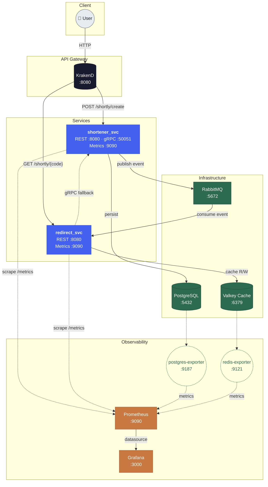

# Shortly: Event-Driven URL Shortener Microservices

**Shortly** is a portfolio project designed to showcase a robust, scalable, and **cloud-agnostic** event-driven microservices architecture built with **Go**. The system enables shortening long URLs and performing high-speed redirections through distributed caching and efficient inter-service communication.

> 🔬 **Highlights for your CV:**
> - **Portable by design**: the same Helm chart + containers run on **Oracle Cloud, AWS (EKS), GCP (GKE) or Azure (AKS)**.
> - **Cloud-native AWS**: when deployed to AWS, infrastructure is delegated to managed services (**RDS**, **ElastiCache**, **Amazon MQ**, **EKS**) provisioned with **Terraform** and deployed via **GitHub Actions with OIDC**.
> - **DevOps/Platform**: IaC, CI/CD, clean architecture, event-driven Go microservices, observability.

## 🏗️ System Architecture



The project implements a decoupled architecture with the following components:

- **KrakenD (API Gateway):** A single entry point that manages routing, rate limiting, and service aggregation.
- **Shortener Service:** Responsible for generating unique short codes, persisting data in PostgreSQL, and publishing events.
- **Redirect Service:** Optimized for ultra-fast redirections. It uses a distributed caching strategy (Valkey) and synchronizes via events or direct gRPC lookups.
- **RabbitMQ:** Message broker for asynchronous communication and event propagation (pre-populating cache upon URL creation).
- **Valkey (Cache):** High-performance in-memory storage to minimize redirection latency.
- **PostgreSQL:** Source of truth for long-term data persistence.
- **Prometheus &amp; Grafana:** Observability stack for metrics collection, custom business dashboards (cache hit ratio, creation throughput, redirect rate), and Go runtime telemetry.

### Data Flow

1. **Creation:** User sends a URL to the Gateway -> `shortener_svc` generates a code -> Persists to Postgres -> Publishes a "created" event to RabbitMQ.
2. **Synchronization:** `redirect_svc` consumes the event from RabbitMQ and stores the mapping in Valkey (Cache).
3. **Redirection:** User requests a code -> `redirect_svc` checks Valkey -> If a Cache Miss occurs, it queries `shortener_svc` via **gRPC** -> Updates cache and redirects the user.

---

## 🛠️ Tech Stack & Tools

- **Language:** Go (v1.25) utilizing Workspaces.
- **Communication:** gRPC (Protocol Buffers) & REST.
- **Messaging:** RabbitMQ 4 (Event-Driven Architecture).
- **Databases:** PostgreSQL 17 & Valkey (Redis-compatible).
- **API Gateway:** KrakenD.
- **Observability:** Prometheus &amp; Grafana.
- **Infrastructure:** Kubernetes (manifests + Helm chart), ready for **EKS / GKE / AKS / Oracle**.
- **Cloud (AWS):** Amazon EKS, RDS PostgreSQL, ElastiCache Redis, Amazon MQ RabbitMQ, ECR.
- **IaC & CI/CD:** Terraform, GitHub Actions (OIDC).
- **Design Patterns:** Clean Architecture, Repository Pattern, Cache-aside, Pub/Sub.

---

## 🚀 Getting Started

### Prerequisites
- Go 1.25+
- **Docker** (to build images).
- **Minikube** (for Kubernetes deployment).
- **kubectl** (Kubernetes CLI).
- **Helm** (package manager for Kubernetes).

> Configuration (endpoints, ports, credentials) is managed entirely by Kubernetes via **ConfigMaps** and **Secrets** — there is no `.env` file involved.

### ☸️ Kubernetes Deployment (Minikube)
For a production-like local environment, you can deploy the entire stack to Kubernetes:

1. **Start Minikube:**
   ```bash
   minikube start
   ```

2. **Build images directly in Minikube's Docker daemon:**
   ```bash
   eval $(minikube docker-env)
   docker build -t shortener_svc:latest ./src/shortener_svc
   docker build -t redirect_svc:latest ./src/redirect_svc
   ```

3. **Deploy all manifests:**
   ```bash
   kubectl apply -f k8s/
   ```

4. **Access the Gateway:**
   ```bash
   # Get the URL for the KrakenD service
   minikube service krakend --url
   ```
   *The gateway is exposed on NodePort 30080 by default.*

### 📦 Helm Deployment (Automated)
The most professional way to deploy this project is using **Helm**. It allows you to manage the entire stack as a single package.

1. **Install the Chart:**
   ```bash
   helm install shortly ./charts/shortly
   ```

2. **Verify the installation:**
   ```bash
   helm list
   kubectl get pods
   ```

3. **Upgrade configuration (optional):**
   If you change something in `values.yaml`, simply run:
   ```bash
   helm upgrade shortly ./charts/shortly
   ```

4. **Uninstall:**
   ```bash
   helm uninstall shortly
   ```

---

### ☁️ Amazon Web Services (EKS + Managed Services)

The project is **cloud-agnostic**, but when deployed to AWS it takes full advantage of managed services. This is the recommended path to showcase AWS/native cloud knowledge.

```
User → ALB → KrakenD (EKS) → shortener_svc (EKS) ──► Amazon RDS PostgreSQL
                             redirect_svc (EKS) ──► ElastiCache Redis · Amazon MQ RabbitMQ
```

| Component      | In AWS it runs on         | Why it matters                          |
|----------------|---------------------------|-----------------------------------------|
| Microservices  | **Amazon EKS** (Helm)     | Same chart as Oracle/GKE/AKS → portable |
| Gateway (KrakenD) | EKS + ALB Ingress      | Managed TLS (ACM) + DNS (Route53)       |
| PostgreSQL     | **Amazon RDS**            | Backups, Multi-AZ, PITR                  |
| Valkey cache   | **ElastiCache Redis**     | Valkey = Redis fork → compatible client |
| RabbitMQ       | **Amazon MQ for RabbitMQ**| Managed AMQP broker                      |
| Images         | **Amazon ECR**            | Private registry                         |
| CI/CD          | **GitHub Actions + OIDC** | No exposed AWS keys                      |
| IaC            | **Terraform**             | VPC, EKS, RDS, ElastiCache, MQ, IAM      |

📄 **Full migration guide:** [`docs/migrate-to-aws.md`](docs/migrate-to-aws.md)

**Key advantages:**
- **Portability:** no vendor lock-in. The same containers/Helm run anywhere Kubernetes exists.
- **Managed data plane:** no need to self-host Postgres/Valkey/RabbitMQ pods and their storage.
- **Security:** GitHub OIDC federation, restricted Security Groups, secrets from AWS Secrets Manager/SSM.

---

## 📖 API Documentation

The system exposes its services through the `krakend` service (NodePort `30080` locally; ALB Ingress in the AWS deployment).

### 1. Create a Short URL
**Endpoint:** `POST /shortly/create`

**Request:**
```json
{
  "raw_url": "https://www.google.com"
}
```

**Response:**
```json
{
  "id": 1,
  "raw_url": "https://www.google.com",
  "short_code": "xY8z2A",
  "created_at": "2026-03-13T10:00:00Z"
}
```

### 2. Redirection
**Endpoint:** `GET /shortly/{short_code}`

**Example:** `GET http://localhost:8080/shortly/xY8z2A`
*Result: 302 Redirect to the original URL.*

---

## 📐 Design Decisions

- **gRPC vs REST:** Internal communication uses gRPC for its efficiency and strong typing, while the Gateway exposes REST for compatibility with web/mobile clients.
- **Valkey (Redis fork):** Chosen for its performance in read-intensive scenarios and open-source compatibility.
- **Event-Driven Cache:** The cache is pre-populated via RabbitMQ events to ensure redirections are near-instant immediately after creation, without waiting for the first manual lookup.

---

## 👨‍💻 Author
[FreyreCorona]
- [LinkedIn](https://www.linkedin.com/in/einier-freyre-896981220)
- [GitHub](https://github.com/FreyreCorona)
